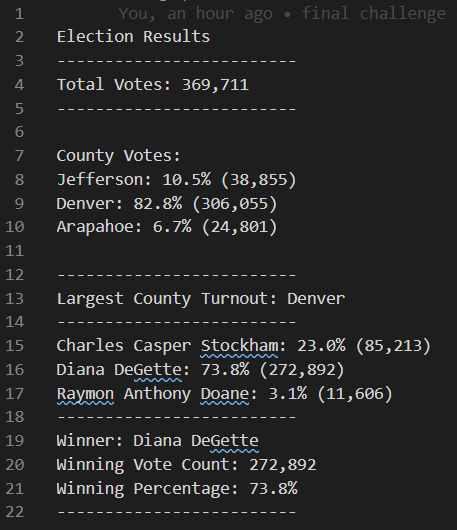
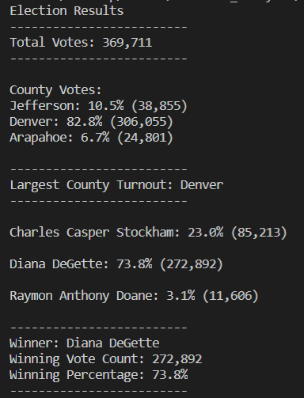

# Election_Analysis

## Project Overview
A Colorado Board of Elections employee gave me the following tasks to complete the election audit of a recent local congressional election.

1. Calculate the total number of votes cast.
2. Get a complete list of candidates who received votes.
3. Calculate the total number of votes each candidate received.
4. Calculate the percentage of votes each candidate received.
5. Determine the winner of the election based on popular vote.
6. Voter turnout for each county
7. The percentage of votes from each county out of the total votes
8. The county with the highest voter turnout
   
## Resources
- Data Source: election_results.csv
- Software: Python 3.7.6, Visual Studio Code, 1.47.3
  
## Results
The analysis of the election results show that:
- There were 369,711 votes cast in the election.
  
To get the total votes cast, I loaded the csv file into python and set up a variable to count the total votes and used a `for` loop to tabulate each ballot
  

```py
#create and set up total_votes
total_votes = 0
with open(file_to_load, 'r') as election_data:
    file_reader = csv.reader(election_data)

    #print header row and will also skip the header in the analysis
    headers = next(file_reader)
    #print each row in the CSV file

    for row in file_reader:
        total_votes += 1
```
- The candidates were:
  - Charles Casper Stockham
  - Diana DeGette
  - Raymon Anthony Doane

To find each unique candidate and calculate their results, I set up a conditional that added a candidate's name to a dictionary I called `candidate_votes` if the candidate name was not already listed as a key in the dictionary. The values for the dictionary were the votes that went to each candidate. 

I did the same coding for a dictionary I called `county_votes`. I also placed it within the same same `for` loop to keep the process as efficient as I could.

```py
for row in file_reader:
        ...
        candidate_name = row[CANDIDATE_NAME_COL]
        #add unique candidate's name to the list with append
        if candidate_name not in candidate_votes:
            candidate_votes[candidate_name] = 0
        #add votes to candidate counts
        candidate_votes[candidate_name] += 1
        
        county_name = row[COUNTY_NAME_COL]
        if county_name not in county_votes:
            county_votes[county_name] = 0
        county_votes[county_name] += 1
```
- The candidate results were:
  - Charles Casper Stock received 23.0% percent of the vote and 85,213 votes.
  - Diana DeGette received 73.8% of the vote and 272,892 votes.
  - Raymon Anthony Doane received 3.1% of the vote and 11,606 votes.
- The county turnout results were:
  - Jefferson County had a 10.5% turnout with 38,855 voters
  - Denver County had a 82.8% turnout with 306,055 voters
  - Arapahoe had a 6.2% voter turnout with 24,801 voters
- County with the highest voter turnout and the most voters was Denver County.
- The Winner of the election was:
  - Diana DeGette, who received 73.8% of the vote and 272,892 votes.
  
To produce the output of the candidate and county results, I used the information from the `for` loop and assembled the output for the election audit from three different parts, as shown below:

```py
winning_candidate_vote_count = 0
winning_candidate_name = 'no candidate'
winning_candidate_vote_percentage = 0

winning_county_vote_count = 0
winning_county_name = 'no county'
winning_county_vote_percentage = 0

...
#need to get percentage of votes for each candidate
for name, vote_count in candidate_votes.items():
    vote_percentage = vote_count / total_votes * 100

    if vote_count > winning_candidate_vote_count:
        winning_candidate_vote_count = vote_count
        winning_candidate_vote_percentage = vote_percentage
        winning_candidate_name = name

#percentage of votes etc for county
for name, vote_count in county_votes.items():
    vote_percentage = vote_count / total_votes * 100

    if vote_count > winning_county_vote_count:
        winning_county_vote_count = vote_count
        winning_county_vote_percentage = vote_percentage
        winning_county_name = name

part3_output = (
    "-------------------------\n"
    f"Winner: {winning_candidate_name}\n"
    f"Winning Vote Count: {winning_candidate_vote_count:,}\n"
    f"Winning Percentage: {winning_candidate_vote_percentage:.1f}%\n"
    "-------------------------"
)

part1_output = (
    'Election Results\n'
    '-------------------------\n'
    f'Total Votes: {total_votes:,}\n'
    '-------------------------\n'
    '\n'
    'County Votes:\n'
)

for name, vote_count in county_votes.items():
    vote_percentage = vote_count / total_votes * 100
    part1_output += f'{name}: {vote_percentage:.1f}% ({vote_count:,})\n'

part1_output += (
    '\n'
    "-------------------------\n"
    f'Largest County Turnout: {winning_county_name}\n'
    "-------------------------\n"
)

candidate_name_strings = []
for name, vote_count in candidate_votes.items():
    vote_percentage = vote_count / total_votes * 100
    candidate_name_strings.append(f'{name}: {vote_percentage:.1f}% ({vote_count:,})\n')

part2_output = '\n' + '\n'.join(candidate_name_strings) + '\n'
```

I separated the code into different parts to adjust for two different style outputs the elections employee specified she wanted.

One of the outputs was a python interpreter output and the other was a textfile. The python interpreter output had no space at the top and the candidates were separated by spaces whereas the textfile results output had a space at the top and the candidate names were not separated by any spaces.

I used a new line character or `'\n'` to adjust for the difference. 

The textfile output:



The python output:



## Summary

This script can be used—with some modifications—for any election and would be useful for anyone wanting to tabulate results. 
The way this code is written, if the data  is in a similar format, the code should work for any number of counties and candidates election officials would like to audit.
I set up input variables at the beginning to allow for some customization in terms of where data is coming from and what columns people are looking to analyze. 

Specific ways to modify the script include:
1. By changing the constants defined at the top of the file, election officials can adjust which columns should be interpreted as candidates or counties.
2. Election officials can change the file path pointing to the input data.
3. Election officials can change the file path to the output data as well as the name of the output data.

If the data is in a different format, I could rewrite the script, but the outputs would be effectively the same.